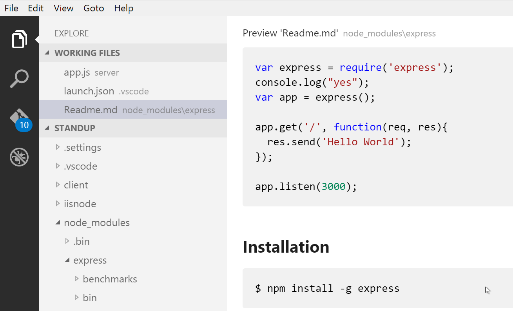

ctrl+shift+v
ctrl+\

# 標題1
## 標題2
### 標題3
#### 標題4
##### 標題5
###### 標題6
1. 數字+點+空格 
2. http://wiki.ros.org/indigo/Installation/Ubuntu ROS indigo安裝
3. http://www.ros.org/ ROS論壇

- 減+空格
- http://wiki.ros.org/universal_robot UR在ROS介紹

name | score | left | right
--- |:-----:|:----|--:
Sam | 100 |123 |123 
Bob | 80 |321 |321

超連結
[google1](www.google.com)

超連結(圖片)


本地圖


```
程式
```

```js
程式有顏色
```

<br> 換行
<hr> 線換行

alt加shift   選很多行

